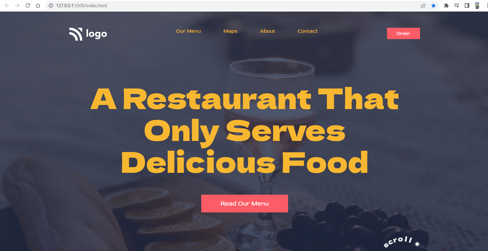

# Project 2: Food Restaurant Home Page

   

### Name:

> `Anshul Ghogre`

## Key Learnings from the project

- _Learn to include background image in the background of this project also to implement the gradient over it._

---

### Screenshots:-

---

> Time taken to complete this project: 5hrs

---

## [Live-Link](https://project-1-street-style-landing1-page.netlify.app/)

---
